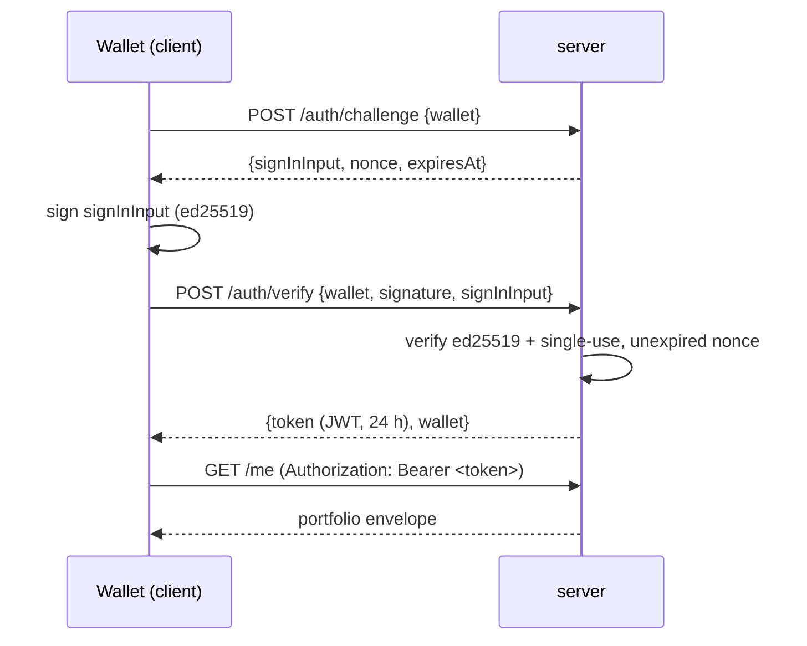
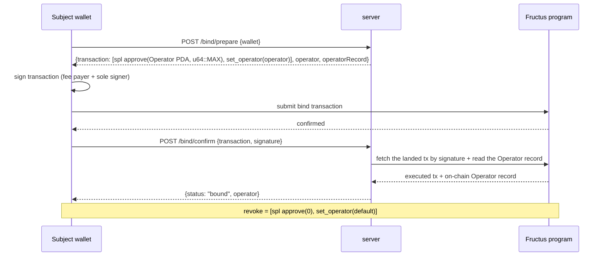

# API (HTTP + WebSocket surface)

**Purpose:** the off-chain `server/` surface (product-v2 REQ-B-7 plus the product-v3
K-line reads): SIWS wallet login, the operator **bind** relay, portfolio and market reads,
the `/actions/*` write routes, the devnet faucet, health, and the WebSocket push
channel. The route table below is the contract — it mirrors
[`api/openapi.json`](api/openapi.json) and the server's exported `ROUTES`.

All REST responses use one JSON envelope:

```
{ "ok": true,  "data": <T> }                          // success
{ "ok": false, "error": { "code": "...", "message": "..." } }   // failure
```

`code` is a stable machine string (a `FructusError` name such as
`OperatorUnauthorized`, or a transport error such as `not_found` /
`unauthorized` / `not_implemented`). Amounts, rates, accumulators and seqs in
payloads are **decimal strings** of raw base units (USDC microunits, u64/i128)
— JSON numbers cannot carry them exactly.

## REST routes

| Method | Path | Auth | Description |
| --- | --- | --- | --- |
| `POST` | `/auth/challenge` | public | Issue the SIWS challenge: `{wallet}` → `{signInInput, nonce, expiresAt}` (expiry ≤ 5 min) |
| `POST` | `/auth/verify` | public | Verify the ed25519 signature over `signInInput`; issue the 24 h session `{token, wallet}` |
| `POST` | `/bind/prepare` | public | Build the wallet-signable operator bind transaction (base64): `[spl approve, set_operator]` + `{operator, operatorRecord}` |
| `POST` | `/bind/confirm` | public | Verify the wallet-submitted bind transaction landed (fetch by signature) and report the on-chain operator record: `status: "bound"` or `status: "revoked"` |
| `GET` | `/me` | JWT | Full portfolio: `deposited`, `reserved`, `claimable`, `free`, `equity`, `requirementInitial`, `requirementMaint`, `health`, `operator`, `positions` |
| `GET` | `/me/positions` | JWT | The wallet's position views (one per side) |
| `GET` | `/me/history` | JWT | Indexed fills + funding rows in seq order |
| `GET` | `/market` | public | Market snapshot: `mark`, `index`, `fundingAccumulator`, `bestBid`, `bestAsk` |
| `GET` | `/market/book` | public | L2 book levels `[price, size]`, best first |
| `GET` | `/market/candles` | public | OHLCV candles over the sampled price series (mark samples ∪ trades): `interval` required (`1m`/`5m`/`15m`/`1h`/`4h`/`1d`), `limit` 1..1000 (default 300); ascending, compact; `400` on bad params |
| `GET` | `/market/trades` | public | Recent market trades (fills), descending by seq: `limit` 1..200 (default 50); `timeMs` is null only for pre-migration rows |
| `POST` | `/actions/deposit` | JWT | Build/submit a deposit action (`{amount}`) |
| `POST` | `/actions/withdraw` | JWT | Build/submit a withdrawal action (`{amount}`) |
| `POST` | `/actions/orders` | JWT | Place a limit or market order (`{kind, side, size, price?}`) |
| `POST` | `/actions/orders/cancel` | JWT | Cancel a resting order (`{side, seq}`) |
| `POST` | `/actions/positions/close` | JWT | Close position size (`{side, size}`) |
| `POST` | `/faucet` | public | Mint test USDC to the wallet's ATA (`{wallet}`); `404` when the faucet is disabled |
| `GET` | `/healthz` | public | `{status: "ok", slot}` — last indexed slot (`null` before the first resync) |

Everything under `/me` and `/actions` is JWT-gated (`Authorization: Bearer
<token>`); `/auth/*`, `/bind/*`, `/market*`, `/faucet` and `/healthz` are public.
Every successful `/actions/*` response is the confirmed attempt:
`{actionId, signature, status: "confirmed"}` — the route answers once the
action has been submitted and confirmed on chain. A rejected or failed action
surfaces through the error envelope (`{ok: false, error: {...}}`) instead; the
wallet receives the `tx` WebSocket push with the same confirmed
`ActionResponse` when the action lands (see [api/ws.md](api/ws.md)).

The product-v3 K-line reads: `/market/candles` merges the served price series —
the server's mark samples (book mid → pool-rate index → last trade, every
`MARK_SAMPLE_INTERVAL_MS`) and the timed fills — into buckets by
`bucket = floor(timeMs / intervalMs) × intervalMs`. Only non-empty buckets are
served, ascending, at most `limit` of them, with the window ending at the
latest point's bucket; fills without a block time are excluded. Buckets exist
without trades (flat open==close candles), volume/trades come from the fills
only, and higher timeframes are the standard fold of the base buckets. It is
the chart source for the terminal. `/market/trades` is the tape source.

## SIWS login flow



The challenge is single-use and expires ≤ 5 minutes after issuance; replaying an
`signInInput` (or signing a mismatched one) fails verification.

## Operator bind / revoke flow



The server never holds the subject's keys and never submits the bind
transaction: `/bind/prepare` returns it unsigned (base64), the wallet signs and
sends it, and `/bind/confirm` verifies the landed result — the on-chain
`Operator` record, not the server, is the authority for the reported status.

After a bind, the operator key can act for the wallet through the program's
`operator_*` instructions without further wallet signatures — see
[modules/operator.md](modules/operator.md) for the delegation model and trust
story.

## Faucet

`POST /faucet {wallet}` mints test USDC to the wallet's ATA (devnet only).
Caps: per-wallet **10,000 tUSDC / 24 h** plus a global `FAUCET_GLOBAL_CAP` /
24 h. When the faucet is not configured the route answers `404`
(`FaucetDisabledError`); a cap breach answers the `FaucetCapError` code.

## WebSocket

`GET /ws?token=<session JWT>` upgrades to the push channel; a missing, invalid
or expired token closes the socket with code **4401**. The five push message
types (`book`, `mark`, `user`, `tx`, `trade`) are documented in
[api/ws.md](api/ws.md).

## Health

`GET /healthz` → `{ok: true, data: {status: "ok", slot: <number|null>}}`,
where `slot` is the last slot the indexer has consumed (`null` before the first
resync). Use it for readiness probes and lag detection.
