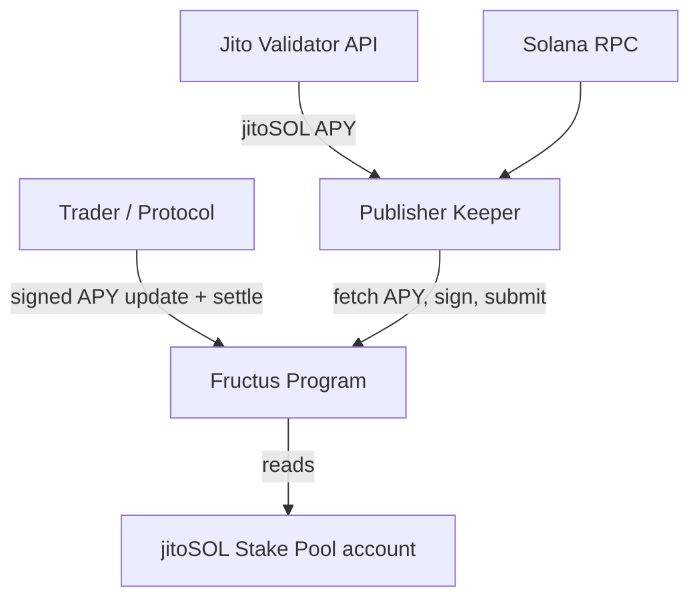
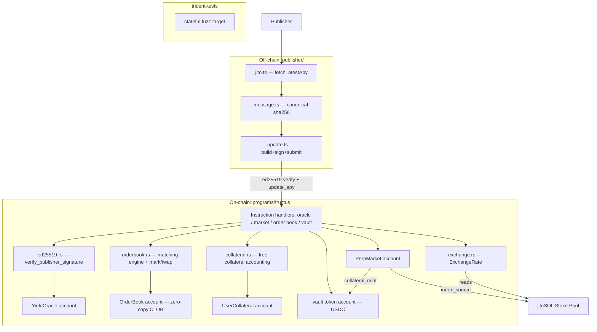

# Architecture

Fructus is a Solana yield-futures protocol. The current codebase implements the
**data module** (a mark-price APY oracle and a trustless settlement reference for
jitoSOL yield), the **perpetual-market account** that binds them into a tradeable
instrument, a fully **on-chain order book (CLOB)** whose mid is the
market-discovered mark, and a **USDC collateral vault** for deposit/withdraw.
Product-v2 adds the **account-level margin model** (cross margin, no netting),
the per-`(market, user)` **operator delegation** surface, and an off-chain
**backend** (`server/`) exposing the HTTP + WebSocket API ([api.md](api.md)).

## System Context (C4 Level 1)

## Container Diagram (C4 Level 2)

## Data Flow

### Mark-price APY update (pull + fallback)

1. A trader's transaction carries the signed APY (pull), or the keeper submits it
   (fallback).
2. `update_apy` verifies the ed25519 signature against the stored publisher and
   the canonical message, enforces version monotonicity and APY bounds, then
   stores `apy` + `version` + `last_update_slot`.

### Settlement (trustless)

1. `read_exchange_rate` validates the pool account owner + `account_type` and
   reads `total_lamports` / `pool_token_supply`.
2. `ExchangeRate::realized_yield` derives `(rate_t1 / rate_t0 − 1) · SCALE`
   between two snapshots.
3. `settle_close` / `settle_funding` / `liquidate` route the signed PnL through
   the Design A market PnL pool (`settlement.rs`): a loss is **collected** into
   `PerpMarket.pnl_pool`, a winner is paid **only up to the pool** (the
   remainder becomes a pending `UserCollateral.claimable`), so `Σ deposited`
   never exceeds the vault's real balance — no minting (details:
   [modules/settlement.md](modules/settlement.md),
   [modules/funding.md](modules/funding.md),
   [modules/liquidation.md](modules/liquidation.md)).

## Architectural Decisions

| Decision | Rationale | Status |
| --- | --- | --- |
| Mark price (oracle) and settlement (exchange rate) are separate sources | Settlement must be trustless/unmanipulable; mark price only needs freshness | Active |
| Pull oracle with permissionless signed updates | Saves chain writes when idle; anyone may relay signed data | Active |
| ed25519 signature via instruction introspection, byte-level comparison | Anchor 1.x "Address" migration makes `Pubkey`/`Address` types version-fragile; bytes are stable | Active |
| Trustless settlement reads the SPL Stake Pool account directly | Exchange rate is on-chain state → cannot stale or be manipulated | Active |
| `u128` intermediates in yield math | Avoid overflow on `u64` numerator/denominator products | Active |
| Singleton `PerpMarket` PDA for Stage 1 | One jitoSOL perp ships first; multi-market (Stage 3) parameterizes the seed | Active |
| Market config validated at init (fixed-point funding + bps margins) | Reject invalid config atomically; vault custody is a later issue | Active |
| Cross-language message vector test | Locks publisher ↔ program signature consistency | Active |
| On-chain order book (CLOB), not an AMM | Mark must be market-discovered; matching stays on-chain, crank only drains the event queue | Active |
| `mark` = order-book mid | The instant price funding anchors to; derived from on-chain book state, never an oracle | Active |
| `OrderBook` is zero-copy (`#[account(zero_copy)]`) | ~21 KB account exceeds the SBF 4 KiB stack limit for borsh deserialization | Active |
| Custom minimal CLOB (no OpenBook) | Matching is simple enough to build in-repo; aligns with the granular-crate ethos | Active |
| USDC collateral vault PDA (self-authorized) | Only the program can move vault funds; per-user ledger separates free vs reserved collateral | Active |
| Account-level (cross-margin, NO-netting) liquidation | 「全倉」semantics: the trigger reads the account's `equity = deposited + Σ upnl` against the summed two-side maintenance requirement; the transition targets one side (`other_position` supplies the sibling's contribution) | Active |
| Per-`(market, user)` operator delegation (`set_operator` + `operator_*`) | Hot-key trading without a wallet signature per action: one-time SPL `approve` + record bind; every effect attributed to the subject; revocable in place (never closed) | Active |
| Off-chain `server/` backend (SIWS login, bind relay, `/actions/*`, WS push) | The frontend contract (REQ-B-7/D14): wallet-signed bind once, operator-key UX thereafter — see [api.md](api.md) | Active |
