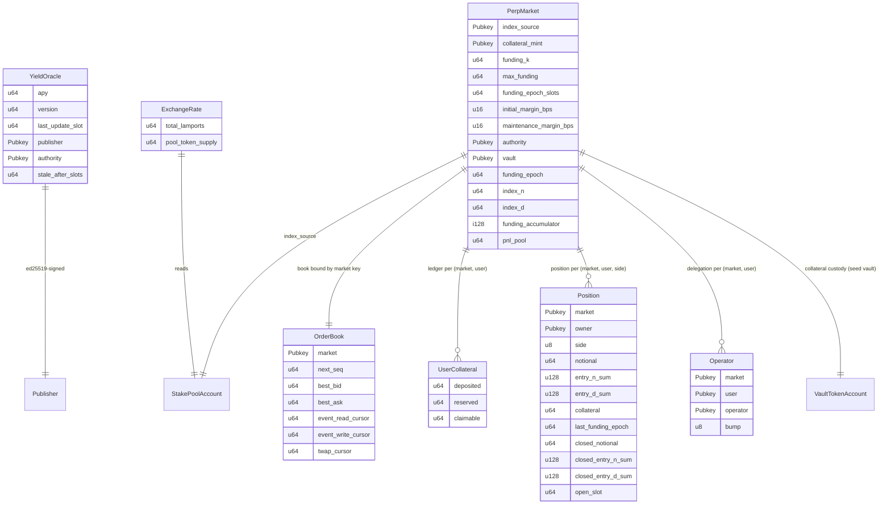

# Data Models

On-chain data shapes: the oracle account, the perpetual-market account, the
order book (with its inline `Order`/`OutEvent`/`Observation` sub-structs), the
collateral ledger, the per-`(market, user, side)` position ledger, the operator
delegation record, and the derived exchange rate.

## `YieldOracle` (anchor account)

Singleton PDA, seed `"yield_oracle"`. Borsh layout (after the 8-byte discriminator):

| Field | Type | Offset (payload) | Notes |
| --- | --- | --- | --- |
| `apy` | u64 | 0 | scaled by `1_000_000` |
| `version` | u64 | 8 | monotonic |
| `last_update_slot` | u64 | 16 | |
| `publisher` | Pubkey | 24 | authorized signer |
| `authority` | Pubkey | 56 | admin |
| `stale_after_slots` | u64 | 88 | staleness window |
| `bump` | u8 | 96 | PDA bump |

## `PerpMarket` (anchor account)

Singleton PDA, seed `"perp_market"`. Borsh layout (after the 8-byte discriminator):

| Field | Type | Offset (payload) | Notes |
| --- | --- | --- | --- |
| `index_source` | Pubkey | 0 | jitoSOL SPL Stake Pool account (validated at init) |
| `collateral_mint` | Pubkey | 32 | USDC mint (stored as-is, no on-chain check) |
| `funding_k` | u64 | 64 | convergence speed; fixed-point scale `1_000_000` |
| `max_funding` | u64 | 72 | per-epoch funding-rate cap; fixed-point scale `1_000_000` |
| `funding_epoch_slots` | u64 | 80 | epoch length in slots |
| `initial_margin_bps` | u16 | 88 | initial margin, basis points |
| `maintenance_margin_bps` | u16 | 90 | maintenance margin, basis points |
| `authority` | Pubkey | 92 | admin |
| `vault` | Pubkey | 124 | collateral-custody PDA (derived, not created at init) |
| `funding_epoch` | u64 | 156 | last settled funding epoch index; `0` before the first `settle_funding` (R-F4) |
| `index_n` | u64 | 164 | stake-pool rate snapshot **numerator** at the last `settle_funding` (the epoch baseline; R-F4) |
| `index_d` | u64 | 172 | stake-pool rate snapshot **denominator**; `index_n/index_d == 0` marks an un-set baseline |
| `funding_accumulator` | i128 | 180 | cumulative signed funding realized on the market (net-additive; long flows negative, short positive) |
| `pnl_pool` | u64 | 196 | market-level PnL pool (Design A): USDC microunits collected from losers, funding winner credits (`min(credit, pool)`; remainder → per-user `claimable`) |
| `bump` | u8 | 204 | PDA bump |

- `LEN = 205` (packed borsh payload, excluding the 8-byte discriminator).
- Singleton seed `"perp_market"`; `index_source` and `collateral_mint` are plain
  fields, not seed components.
- `funding_k` / `max_funding` use the fixed-point scale `1_000_000`
  (`1.0 == 1_000_000`); the two margin fields use basis points (≤ `10_000`).
- The funding state (`funding_epoch` / `index_n` / `index_d` /
  `funding_accumulator`) and the `pnl_pool` are zero-initialized at init and
  written by `settle_funding` / `settle_close` / `liquidate` (see
  [modules/funding.md](modules/funding.md), [modules/settlement.md](modules/settlement.md),
  [modules/liquidation.md](modules/liquidation.md)); `i128` borsh-serializes to
  16 LE bytes.

## `OrderBook` (zero-copy account)

One PDA per market, seed `[b"order_book", market.key()]`. Zero-copy (`#[repr(C)]`)
layout (after the 8-byte discriminator); fields are reordered and explicitly
padded so `bytemuck::Pod` has no implicit padding:

| Field | Type | Offset (payload) | Notes |
| --- | --- | --- | --- |
| `next_seq` | u64 | 0 | monotonic order id |
| `best_bid` | u64 | 8 | highest resting bid; `0` = side empty |
| `best_ask` | u64 | 16 | lowest resting ask; `0` = side empty |
| `event_read_cursor` | u64 | 24 | next event to drain |
| `event_write_cursor` | u64 | 32 | next event slot to write |
| `twap_cursor` | u64 | 40 | next TWAP observation slot |
| `market` | Pubkey | 48 | bound market (also in the PDA seed) |
| `bump` | u8 | 80 | PDA bump |
| `_pad` | `[u8; 7]` | 81 | explicit padding (8-align) |
| `bids` | `[Order; 16]` | 88 | resting bids; 64 bytes each |
| `asks` | `[Order; 16]` | 1112 | resting asks; 64 bytes each |
| `events` | `[OutEvent; 32]` | 2136 | event-queue ring; 112 bytes each |
| `observations` | `[Observation; 16]` | 5720 | TWAP ring; 32 bytes each |

- `LEN = 6_232` (`size_of::<OrderBook>()`, excluding the 8-byte discriminator;
  the single account is `8 + LEN = 6_240` bytes). Sized so `initialize_order_book`
  can allocate it in one transaction within the SBF `MAX_PERMITTED_DATA_INCREASE`
  (10 KiB) cap.
- Fixed capacities: `MAX_ORDERS_PER_SIDE = 16`, `EVENT_QUEUE_LEN = 32`,
  `TWAP_OBSERVATIONS = 16`. The book's side is implied by which array an `Order`
  sits in (`bids` vs `asks`), so no side byte is stored.
- Zero-copy is required because the account exceeds the SBF 4 KiB stack limit for
  borsh deserialization; handlers access it via `AccountLoader::load_mut()`.

### `Order` (sub-struct)

| Field | Type | Offset (payload) | Notes |
| --- | --- | --- | --- |
| `owner` | Pubkey | 0 | signer who placed the order |
| `price` | u64 | 32 | `APY_SCALE` fixed point; `0` invalid |
| `size` | u64 | 40 | remaining (unfilled) size, notional USDC microunits |
| `seq` | u64 | 48 | monotonic order id (time priority) |
| `active` | u8 | 56 | `0` = empty slot |
| `_pad` | `[u8; 7]` | 57 | explicit padding (8-align) |

- `LEN = 64`. `active` is `u8` (not `bool`) because `bytemuck::Pod` forbids `bool`.

### `OutEvent` (sub-struct)

| Field | Type | Offset (payload) | Notes |
| --- | --- | --- | --- |
| `seq` | u64 | 0 | monotonic event id |
| `price` | u64 | 8 | traded price (fill) or order price |
| `size` | u64 | 16 | traded size (fill) or remaining size |
| `owner` | Pubkey | 24 | order owner |
| `counterparty` | Pubkey | 56 | matched counterparty (zero when unset) |
| `entry_total_lamports` | u64 | 88 | fill-time index snapshot numerator (`total_lamports`); `0` on non-fill events |
| `entry_pool_token_supply` | u64 | 96 | fill-time index snapshot denominator (`pool_token_supply`); `0` on non-fill events |
| `settled` | u8 | 104 | `0` = Fill pending maker settlement; `1` = consumed by `settle_fill` (meaningless on other kinds) |
| `kind` | u8 | 105 | `0` = Fill, `1` = Cancel, `2` = Residual |
| `side` | u8 | 106 | `0` = Bid, `1` = Ask |
| `_pad` | `[u8; 5]` | 107 | explicit padding (8-align) |

- `LEN = 112`. The fill-time index snapshot (D7/D8) lets `settle_fill` book a
  resting maker at the rate that was in effect when the fill executed — not at
  settlement time — and the `settled` flag makes settlement idempotent.

### `Observation` (sub-struct)

| Field | Type | Offset (payload) | Notes |
| --- | --- | --- | --- |
| `slot` | u64 | 0 | slot at which the sample was recorded |
| `mid` | u64 | 8 | mid price in effect at this sample (`0` = one-sided/undefined) |
| `cumulative_mid` | `[u8; 16]` | 16 | running `Σ mid × Δslot` (LE `u128`) |

- `LEN = 32`. `cumulative_mid` is stored as 16 raw bytes (not `u128`) for
  cross-target alignment stability in the zero-copy layout.

## `UserCollateral` (anchor account)

One PDA per `(market, user)`, seed `[b"user_collateral", market.key(),
user.key()]`. Borsh layout (after the 8-byte discriminator):

| Field | Type | Offset (payload) | Notes |
| --- | --- | --- | --- |
| `deposited` | u64 | 0 | USDC credited to the user, microunits |
| `reserved` | u64 | 8 | USDC reserved for open positions; `= Σ` position collateral (issue #5) |
| `claimable` | u64 | 16 | pending (unfunded) PnL/funding claim (Design A); not directly withdrawable — converted to `deposited` only via claim payout against `PerpMarket.pnl_pool` |
| `bump` | u8 | 24 | PDA bump |

- `LEN = 25`.
- Lazily initialized on first deposit; `reserved` is written by the position
  lifecycle (`open_position` / `close_position` / `settle_fill` reserve and
  release margin atomically with the `Position` ledger).
- `deposited = reserved + free` remains the core invariant; `claimable` is
  **orthogonal** (a pending claim is not part of `deposited` and is not
  withdrawable except through claim payout).

## `Position` (anchor account)

One PDA per `(market, user, side)`, seed
`[POSITION_SEED, market.key(), user.key(), side]` with
`POSITION_SEED = b"position"`. Borsh layout (after the 8-byte discriminator):

| Field | Type | Offset (payload) | Notes |
| --- | --- | --- | --- |
| `market` | Pubkey | 0 | bound market (also in the PDA seed) |
| `owner` | Pubkey | 32 | user holding the position (also in the PDA seed) |
| `side` | u8 | 64 | `0` = Long/Bid, `1` = Short/Ask (`SIDE_BID`/`SIDE_ASK`) |
| `notional` | u64 | 65 | remaining position, USDC microunits; `0` == closed |
| `entry_n_sum` | u128 | 73 | `Σ(total_lamports × fill_size)` — notional-weighted entry-index running sum |
| `entry_d_sum` | u128 | 89 | `Σ(pool_token_supply × fill_size)` — notional-weighted entry-index running sum |
| `collateral` | u64 | 105 | reserved margin = `margin_required(notional, initial_margin_bps)` (ceiling division) |
| `last_funding_epoch` | u64 | 113 | last funding epoch this position was settled for (written by `settle_funding`) |
| `closed_notional` | u64 | 121 | notional closed but not yet realized (written by `close_position`; reset by `settle_close` — R-S1) |
| `closed_entry_n_sum` | u128 | 129 | `Σ` entry numerator carried by `closed_notional` — the entry basis in effect **when it was closed**, recorded by `apply_close_fills` and reset by `settle_close`; a re-open resets the live `entry_*` but never reframes this (R-S2) |
| `closed_entry_d_sum` | u128 | 145 | `Σ` entry denominator carried by `closed_notional` (see above) |
| `open_slot` | u64 | 161 | (re)creation slot: fill slot (inline taker opens) or settlement slot (maker re-opens via `settle_fill`) |
| `bump` | u8 | 169 | PDA bump |

- `LEN = 170`.
- Lazily created on first fill/settlement (payer = user/cranker) and **retained**
  after a full close; `notional == 0` means closed. A re-open resets
  `entry_n_sum` / `entry_d_sum` / `open_slot` and **re-bases
  `last_funding_epoch`** to the re-open epoch (so the reopened notional never
  accrues funding over the closed interval), but leaves
  `closed_entry_n_sum` / `closed_entry_d_sum` **intact** — the close-time entry
  basis of the pending `closed_notional` (never reframed by a re-open).
- The entry index is stored as notional-weighted running sums (exact
  average-cost accounting, no intermediate rounding); the snapshot rate
  `entry_n_sum / entry_d_sum` is computed at PnL time after a shared
  power-of-two normalization (`positions::normalize_sums`).
- `u128` fields borsh-serialize to 16 LE bytes; as a plain borsh `#[account]`
  (well under the 4 KiB zero-copy threshold) the `Position` declares native
  `u128` fields — no per-access byte conversion.
- Margin is ledger-only: `collateral` mirrors the reserved-margin bookkeeping in
  `UserCollateral.reserved`; no token movement on open or close.
- `closed_notional` is the settlement seam (issue #7): a lifecycle-only
  `close_position` records closed fills here, and the permissionless
  `settle_close` realizes their signed PnL (priced at the **close-time** entry
  basis captured in `closed_entry_*`) into `UserCollateral.deposited`
  (clamped so the vault is never insolvent) before resetting all three to `0`.
  See [modules/settlement.md](modules/settlement.md).

## `Operator` (anchor account)

One PDA per `(market, user)`, seed
`[OPERATOR_SEED, market.key(), user.key()]` with `OPERATOR_SEED = b"operator"`.
The `Operator` delegation record is a packed borsh account whose payload is
exactly **97 bytes** (after the 8-byte discriminator):

| Field | Type | Offset (payload) | Notes |
| --- | --- | --- | --- |
| `market` | Pubkey | 0 | bound market (also in the PDA seed) |
| `user` | Pubkey | 32 | the subject user (also in the PDA seed) |
| `operator` | Pubkey | 64 | delegated signer; `Pubkey::default()` = revoked |
| `bump` | u8 | 96 | PDA bump |

- `Operator::LEN = 97` (`32 + 32 + 32 + 1`, packed borsh payload, excluding the
  8-byte discriminator).
- Lazily created by `set_operator` on first bind (payer = user, rent-exempt
  `8 + 97` bytes); create / rotate / revoke all rewrite the same in-place
  record — the account is **never closed** (`Pubkey::default()` is the revoke
  state).
- See [modules/operator.md](modules/operator.md) for the delegation model and
  [api-reference.md](api-reference.md) for the instruction rows.

## `ExchangeRate` (derived, not stored)

| Field | Type | Source |
| --- | --- | --- |
| `total_lamports` | u64 | stake-pool account offset 258 |
| `pool_token_supply` | u64 | stake-pool account offset 266 |

- Rate = `total_lamports / pool_token_supply` (SOL per jitoSOL), kept as a
  rational pair to defer division until the yield computation.
- `realized_yield(t0, t1) = (rate_t1 / rate_t0 − 1) · 1_000_000`, computed with
  `u128` intermediates.

## Relationships

No database / migrations — state lives entirely in Solana accounts.
